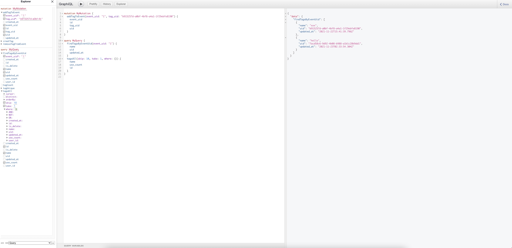

### 开发&部署

#### 本地开发

npm run start:dev

### 开发流程

#### 1. 首先定义业务模型（prisma scheme）

修改 ./prisma/scheme.prisma

添加新的业务模型

```
model xxx {
  id         Int      @id @default(autoincrement())
  uid        String   @unique @default(uuid())
  name       String   @unique @db.VarChar(20)
}
```

#### 2. 创建数据库表

可以使用 prisma cli 创建表结构，不过为了安全起见，最好使用本地数据库操作，然后将数据库的 create sql 同步至其他环境

#### 3. prisma orm sdk 生成

`npm run gen`

之后即可在代码中使用 prisma 的对象

```javascript
this.prisma.tag.findMany({
  skip: (pager.pageIndex - 1) * pager.pageSize,
  take: pager.pageSize,
  where: {
    is_delete: false,
  },
  orderBy: [{ use_count: 'desc' }],
  select: {
    is_delete: false,
    id: false,
    uid: true,
    name: true,
    use_count: true,
    created_at: true,
    updated_at: true,
  },
});
```

#### 4. 创建 crud 接口

`npm run crud`

生成新的业务模型的增伤改查接口，可以选择生成 rest 接口或者 graphql 接口（代码优先）

#### 5. 开发业务逻辑(rest)

修改接口定义 xxx.controller.ts

修改 service 实现：xxx.service.ts

定义 swagger 注解

#### 5. 开发业务逻辑（graphql）

在运行 npm run gen 的过程中，会使用 prisma-nestjs-graphql 生成 gql 类型定义

在 xxx.resolver.ts 中开发逻辑

在使用 gen 生成 gql 的类型代码之后，基本不需要写太多 service 逻辑，特别是普通的单个和列表查询

如：

```

import { FindManytagArgs } from '../@generated/tag/find-manytag.args';
import { FindUniquetagArgs } from '../@generated/tag/find-uniquetag.args';
import { tagWhereInput } from '../@generated/tag/tag-where.input';
import { tagCreateInput } from '../@generated/tag/tag-create.input';
import { tag } from '../@generated/tag/tag.model';
import { tag_event_relation } from '../@generated/tag-event-relation/tag-event-relation.model';

...

@Query(() => [tag], { name: 'tagsAll' })
async findAll(@Args() args: FindManytagArgs) {
    const result = await this.tagsGqlService.findMany({ ...args });
    return result;
}
```

FindManytagArgs 是 生成的类型

this.tagsGqlService.findMany 就是一个透传，内部是 this.prisma.tag.findMany

```

@Injectable()
export class TagsGqlService {
  constructor(private prisma: PrismaService) {}

  update = this.prisma.tag.update;
  delete = this.prisma.tag.delete;
  findUnique = this.prisma.tag.findUnique;
  findMany = this.prisma.tag.findMany;
  count = this.prisma.tag.count;
  create = this.prisma.tag.create;
}

```



#### 6. 查看 swagger 和 graphql playground

swagger 地址：http://localhost:3000/api

graphql playground：http://localhost:3000/index.html

### 其他问题

#### 1. 在接口或者 GQL Resolver 中如何获取用户信息？

rest 接口中

```typescript
@Post()
@ApiOperation({ summary: '新建标签' })
create(@Body() createTagDto: CreateTagDto, @Request() req) {
  createTagDto.user_id = req.user.id;
  return this.tagsService.create(createTagDto);
}
```

GQL Resolver 中

```typescript
@Mutation(() => tag, { name: 'creatTag' })
createTag(@Args('tag') createTagsGqlInput: tagCreateInput, @Context() ctx) {
  createTagsGqlInput.user_id = ctx.req.user.id;
  return this.tagsGqlService.create({
    data: createTagsGqlInput,
  });
}
```
