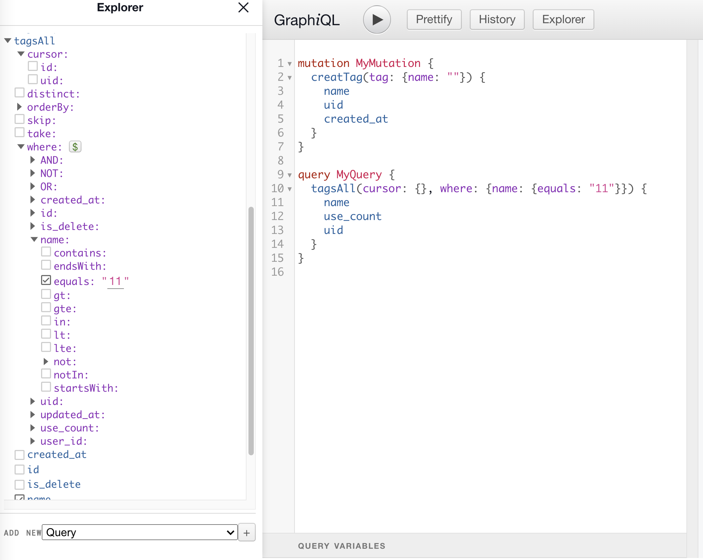

## 介绍

这是一个 prisma + nestjs + graphql 的集成示例

对于开发者来说，特别是使用 graphql 的时候，只需要写非常少量的代码即可完成数据的各种操作，同时也支持接口透传。

### 开发&部署

#### 本地开发

npm run start:dev

swagger 地址：http://localhost:3001/swagger

graphql playground：http://localhost:3001/index.html

### 核心能力

#### 1. prisma 集成

- prisma 接管数据模型定义
- prisma 提供 orm 数据操作
- prisma 提供数据订正和管理

#### 2. graphql 集成

- prisma-nestjs-graphql 提供 prisma 数据模型到 graphql 类型的转换
- 使用 nestjs 内置的代码优先模式，使用生成的类型提供 graphql 模型
- 使用 graphql 模型 + orm，自动通过 resolver 提供给前端访问接口
- 此方案中，普通和高级的增删改查基本不需要自己增加代码

#### 3. restful api proxy

- 通过 swagger-to-graphql 将 openapi 接口通过 oas 文档直接转换为 graphql 定义
- 通过 graphqlHTTP 将请求代理到 restful 接口
- 此方案中，swagger 的描述无缝转换到 graphql 描述，并自动代理请求

#### 4. nestjs 本身一些特性的示例

- 全局钩子，并且兼容 graphql 和 rest 请求，如 登录校验、返回封装、错误处理等
- graphql 集成和配置，graphql 代理集成和配置
- yaml 配置和加载

#### 5. graphiql-explorer 快速组合查询

- 通过 graphiQL 的第三方插件 graphiql-explorer 快速预览和组合 graphql 请求



更多信息：[](./share.md)

### 开发流程

#### 1. 首先定义业务模型（prisma scheme）

修改 ./prisma/scheme.prisma

添加新的业务模型

```
model xxx {
  id         Int      @id @default(autoincrement())
  uid        String   @unique @default(uuid())
  name       String   @unique @db.VarChar(20)
}
```

#### 2. 创建数据库表

可以使用 prisma cli 创建表结构，不过为了安全起见，最好使用本地数据库操作，然后将数据库的 create sql 同步至其他环境

#### 3. prisma orm sdk 生成

`npm run gen`

之后即可在代码中使用 prisma 的对象

```javascript
this.prisma.tag.findMany({
  skip: (pager.pageIndex - 1) * pager.pageSize,
  take: pager.pageSize,
  where: {
    is_delete: false,
  },
  orderBy: [{ use_count: 'desc' }],
  select: {
    is_delete: false,
    id: false,
    uid: true,
    name: true,
    use_count: true,
    created_at: true,
    updated_at: true,
  },
});
```

#### 4. 创建 crud 接口

`npm run crud`

生成新的业务模型的增伤改查接口，可以选择生成 rest 接口或者 graphql 接口（代码优先）

#### 5. 开发业务逻辑(rest)

修改接口定义 xxx.controller.ts

修改 service 实现：xxx.service.ts

定义 swagger 注解

#### 5. 开发业务逻辑（graphql）

在运行 npm run gen 的过程中，会使用 prisma-nestjs-graphql 生成 gql 类型定义

在 xxx.resolver.ts 中开发逻辑

在使用 gen 生成 gql 的类型代码之后，基本不需要写太多 service 逻辑，特别是普通的单个和列表查询

如：

```

import { FindManytagArgs } from '../@generated/tag/find-manytag.args';
import { FindUniquetagArgs } from '../@generated/tag/find-uniquetag.args';
import { tagWhereInput } from '../@generated/tag/tag-where.input';
import { tagCreateInput } from '../@generated/tag/tag-create.input';
import { tag } from '../@generated/tag/tag.model';
import { tag_event_relation } from '../@generated/tag-event-relation/tag-event-relation.model';

...

@Query(() => [tag], { name: 'tagsAll' })
async findAll(@Args() args: FindManytagArgs) {
    const result = await this.tagsGqlService.findMany({ ...args });
    return result;
}
```

FindManytagArgs 是 生成的类型

this.tagsGqlService.findMany 就是一个透传，内部是 this.prisma.tag.findMany

```

@Injectable()
export class TagsGqlService {
  constructor(private prisma: PrismaService) {}

  update = this.prisma.tag.update;
  delete = this.prisma.tag.delete;
  findUnique = this.prisma.tag.findUnique;
  findMany = this.prisma.tag.findMany;
  count = this.prisma.tag.count;
  create = this.prisma.tag.create;
}

```


#### 6. 查看 swagger 和 graphql playground

swagger 地址：http://localhost:3000/swagger

graphql playground：http://localhost:3000/index.html
